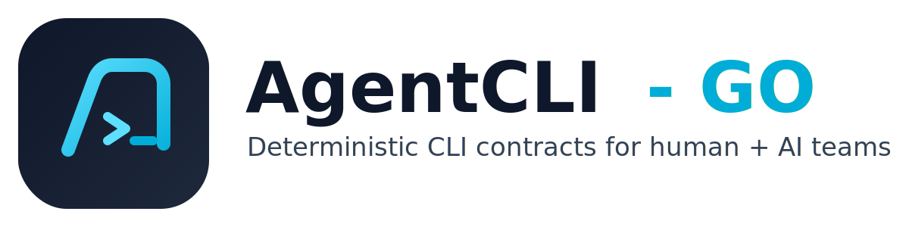

[](https://github.com/gh-xj/agentcli-go/actions/workflows/ci.yml)
[](https://github.com/gh-xj/agentcli-go/releases)
[](./LICENSE)
[](./go.mod)

<p align="center">
  
</p>

Shared Go helpers and framework modules for building personal CLI scripts and tools.

`agentcli-go` is a **library** you import into your Go CLI projects. It provides logging, argument parsing, command execution, and filesystem helpers so you skip boilerplate and focus on your script's logic.

---

# AgentCLI - GO

## Why

- Skip boilerplate: logging, arg parsing, exec, fs helpers ready to import
- Consistent patterns across all your Go CLI scripts
- Scaffold a compliant project in under a minute
- Machine-readable output (`--json`) built into the scaffold from day one

### Harness Engineering value proposition

- Deterministic project scaffolding with opinionated defaults for reproducible setup.
- Built-in quality gates designed for AI-assisted workflows and CI-safe project hygiene.
- Contract-first outputs (schemas + tooling) to make generated CLIs easier to maintain over time.
- Standardized lifecycle/error semantics so teams can onboard agents and scripts faster with fewer “first-run” surprises.
- A practical base for scalable agent/tooling workflows, while keeping the runtime surface small and reviewable.

## Installation

### Library (import into your project)

```bash
go get github.com/gh-xj/agentcli-go@v0.2.1
```

### Scaffold CLI (optional, for generating new projects)

```bash
go install github.com/gh-xj/agentcli-go/cmd/agentcli@v0.2.1
```

Or with Homebrew:

```bash
brew tap gh-xj/tap
brew install agentcli
```

Or download a prebuilt binary (macOS/Linux amd64+arm64):

- https://github.com/gh-xj/agentcli-go/releases/tag/v0.2.1

## Claude Code Skill

For guidance on using this library effectively in Codex/Claude workflows, see [`skills/agentcli-go/SKILL.md`](./skills/agentcli-go/SKILL.md).
For agent-specific onboarding and harness entrypoints, see [`agents.md`](./agents.md).

## Published on ClawHub

This repo is published as an agent skill at: https://clawhub.ai/gh-xj/agentcli-go

---

## Quick Start: Write a Script

```go
package main

import (
    "os"

    "github.com/gh-xj/agentcli-go"
    "github.com/rs/zerolog/log"
)

func main() {
    agentcli.InitLogger()
    args := agentcli.ParseArgs(os.Args[1:])

    src := agentcli.RequireArg(args, "src", "--src path")
    dst := agentcli.GetArg(args, "dst", "/tmp/out")

    if !agentcli.FileExists(src) {
        log.Fatal().Str("src", src).Msg("source not found")
    }

    agentcli.EnsureDir(dst)
    out, err := agentcli.RunCommand("rsync", "-av", src, dst)
    if err != nil {
        log.Fatal().Err(err).Msg("sync failed")
    }
    log.Info().Msg(out)
}
```

Run with: `go run . --src ./data --dst /backup`

---

## API Reference

| Function | Description |
|----------|-------------|
| `InitLogger()` | zerolog setup with `-v`/`--verbose` for debug output |
| `ParseArgs(args)` | Parse `--key value` flags into `map[string]string` |
| `RequireArg(args, key, usage)` | Required flag — fatal if missing |
| `GetArg(args, key, default)` | Optional flag with default |
| `HasFlag(args, key)` | Boolean flag check |
| `RunCommand(name, args...)` | Run external command, return stdout |
| `RunOsascript(script)` | Execute AppleScript (macOS) |
| `Which(bin)` | Check if binary is on PATH |
| `CheckDependency(name, installHint)` | Assert dependency exists or fatal |
| `FileExists(path)` | File/dir existence check |
| `EnsureDir(path)` | Create directory tree |
| `GetBaseName(path)` | Filename without extension |

### Runtime modules

- **`cobrax`** — Cobra adapter with standardized persistent flags (`--verbose`, `--config`, `--json`, `--no-color`) and deterministic exit code mapping
- **`configx`** — Config loading with deterministic precedence: `Defaults < File < Env < Flags`

---

## Quick Start: Scaffold a New Project

Use `agentcli new` to generate a fully-wired project with Taskfile, smoke tests, and schema contracts:

```bash
agentcli new --module github.com/me/my-tool my-tool
cd my-tool
agentcli add command --preset file-sync sync-data
agentcli doctor --json        # verify compliance
task verify                   # run full local gate
```

Generated layout:

```
my-tool/
├── main.go
├── cmd/root.go
├── internal/app/{bootstrap,lifecycle,errors}.go
├── internal/config/{schema,load}.go
├── internal/io/output.go
├── internal/tools/smokecheck/main.go
├── pkg/version/version.go
├── test/e2e/cli_test.go
├── test/smoke/version.schema.json
└── Taskfile.yml
```

Command presets: `file-sync`, `http-client`, `deploy-helper`

---

## Examples

Runnable examples:

- [`examples/file-sync-cli`](./examples/file-sync-cli)
- [`examples/http-client-cli`](./examples/http-client-cli)
- [`examples/deploy-helper-cli`](./examples/deploy-helper-cli)

Examples index: [`examples/README.md`](./examples/README.md)

---

## Project Health

- License: [Apache-2.0](./LICENSE)
- Security policy: [SECURITY.md](./SECURITY.md)
- Contribution guide: currently not available in this repository
- Code of Conduct: [CODE_OF_CONDUCT.md](./CODE_OF_CONDUCT.md)
- Changelog: [CHANGELOG.md](./CHANGELOG.md)

## Documentation Conventions

- Documentation ownership and where to file updates are defined in [docs/documentation-conventions.md](./docs/documentation-conventions.md).

## For Agent-Installed Workflows

If this project is used as an agent skill, start with [`agents.md`](./agents.md), then follow links from there.

## Optional: Advanced verification profiles

`agentcli loop` supports configurable verification profiles (for automation workflows).
See the project-specific guidance in `agents.md`.
